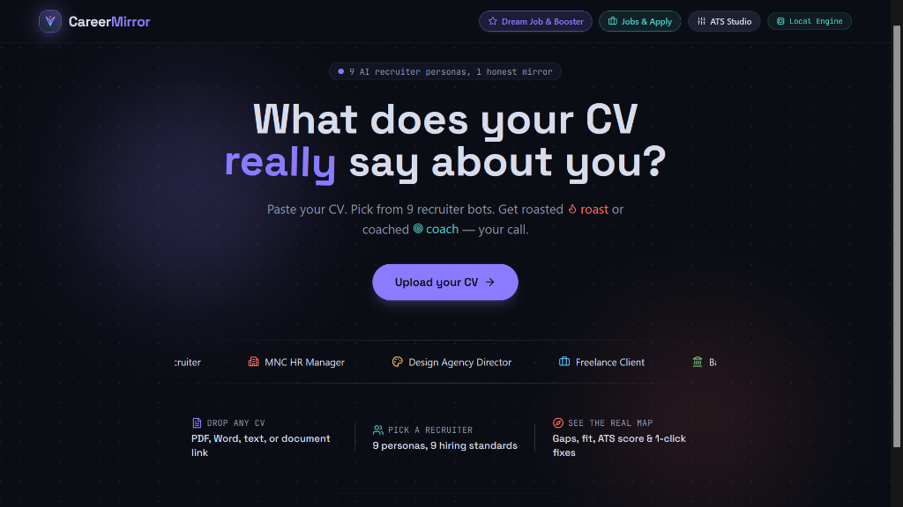

<div align="center">

# 🪞 CareerMirror

### AI Recruiter CV Analysis, Real-Time ATS Checker & Career Fit Platform

<br/>

[](https://careermirror-0rwk.onrender.com/)
[](https://react.dev)
[](https://expressjs.com)
[](https://tailwindcss.com)
[](LICENSE.txt)

<br/>

> **A full-stack, intelligent CV analysis platform that delivers feedback the way real recruiters evaluate candidates — not generic keyword scanning. Upload or paste your resume, select from 9 AI recruiter personas, choose your tone (Coach vs. Roast), and unlock comprehensive skill-fit, career-fit, and ATS health scoring with actionable 1-click fixes.**

<br/>

<p align="center">
  <a href="https://careermirror-0rwk.onrender.com/" target="_blank">
    
  </a>
</p>

<br/>

[🌐 Live Application](https://careermirror-0rwk.onrender.com/) · [✨ Features](#-features) · [🏗️ Architecture & Tech Stack](#%EF%B8%8F-architecture--tech-stack) · [🚀 Getting Started](#-getting-started) · [🛡️ Security](#%EF%B8%8F-security--privacy) · [📄 License](#-license)

</div>

---

## 📖 Overview

Most automated resume checkers stop at superficial keyword matching. **CareerMirror** goes further — evaluating resume structure, clarity, impact metrics, and how authentically your career experience maps to target industry expectations.

Feedback is dynamically shaped by the persona and tone you choose:

| Review Mode | What You Get |
| :--- | :--- |
| **🎯 Coach** | Constructive, structured mentorship — highlighting strengths, addressing weak points, and providing step-by-step improvements. |
| **🔥 Roast** | Unfiltered, high-impact critique — mimicking what an elite recruiter actually thinks during a rapid 6-second resume skim. |

🔗 **Live Deployment:** [https://careermirror-0rwk.onrender.com/](https://careermirror-0rwk.onrender.com/)

---

## ✨ Features

- **9 AI Recruiter Personas** — Experience reviews from diverse industry hiring standards (e.g., *MNC HR Manager, Startup Founder, Tech Lead, Design Agency Director, Finance Recruiter*).
- **Real-Time ATS Scoring Engine** — Granular, weighted diagnostics across *Impact & Metrics, Power Action Verbs, ATS Formatting, and Role-Relevant Keywords*.
- **Split-Pane Live CV Editor & 1-Click Fixer** — Edit directly in the browser, upgrade passive phrases to active power verbs, purge overused buzzwords, and standardize section headers.
- **Dream Job Gap Diagnosis & ATS Booster** — Compare your CV against target job titles, discover missing technical requirements, and receive project blueprint suggestions.
- **Role Navigator & Where to Apply** — Curated job title matching with market salary ranges and 1-click discovery links across LinkedIn, Wellfound, Indeed, and RemoteOK.
- **Dual-Layer Parsing Architecture** — Instant client-side document rendering (PDF.js / Mammoth) paired with server-side extraction (pdf-parse) as the verified source of truth.
- **Interactive Visual Breakdown** — Score radar charts and progress distributions powered by Recharts.
- **Offline Local Heuristics Fallback** — Runs seamlessly with or without external AI API keys using a deterministic local scoring engine (`heuristics.js`).

---

## 🏗️ Architecture & Tech Stack

```
careermirror/
├── frontend/
│   ├── src/
│   │   ├── components/      # UI widgets, split-pane editor, charts & persona selectors
│   │   ├── data/            # Static presets, persona definitions & benchmark roles
│   │   ├── App.jsx          # Main application orchestrator
│   │   └── main.jsx         # React DOM root entry
│   ├── public/              # Static branding and web assets
│   └── package.json         # Frontend dependencies (React 18, Vite, Tailwind CSS)
│
├── backend/
│   ├── server.js            # Express API server & parsing endpoints
│   ├── heuristics.js        # Deterministic local scoring & rule-based engine
│   ├── skillsMap.js         # Comprehensive tech & domain skill taxonomy
│   └── package.json         # Backend dependencies (Express, CORS, pdf-parse)
│
├── banner.png               # High-resolution hero showcase banner
├── LICENSE.txt              # Proprietary license terms
└── README.md                # Project documentation
```

### Technology Layer

| Component | Stack |
| :--- | :--- |
| **Frontend** | React 18, Vite, Tailwind CSS, Framer Motion, Recharts, Lucide Icons |
| **Backend** | Node.js, Express.js REST API |
| **Document Parsing** | Client: PDF.js & Mammoth · Server: `pdf-parse` (source of truth) |
| **Scoring Engine** | AI Model Integration + Local Deterministic Fallback (`heuristics.js`) |

---

## 🚀 Getting Started

### Prerequisites
- [Node.js](https://nodejs.org/) (v18.x or higher)
- [npm](https://www.npmjs.com/)

### 1. Clone the Repository
```bash
git clone https://github.com/Shreyalien/CareerMirror.git
cd CareerMirror
```

### 2. Backend Setup
```bash
cd backend
npm install
npm start
```
*The backend API will run on `http://localhost:5000`.*

### 3. Frontend Setup
```bash
cd ../frontend
npm install
npm run dev
```
*Open `http://localhost:5173` in your browser to start using CareerMirror.*

---

## 🛡️ Security & Privacy

- **Server-Side API Key Protection**: Third-party API keys are strictly evaluated server-side and never exposed to client-side bundles.
- **Ephemeral Document Processing**: Uploaded resume files are parsed in memory and are not permanently stored on disk.
- **Standalone Heuristics Mode**: If no API key is supplied, the local deterministic heuristics engine ensures 100% feature availability without external network dependencies.

---

## 👩‍💻 Author & Maintainer

Created with ❤️ by:

**Shreya**
- GitHub: [@Shreyalien](https://github.com/Shreyalien)
- Project: [CareerMirror](https://github.com/Shreyalien/CareerMirror)
- Live: [careermirror-0rwk.onrender.com](https://careermirror-0rwk.onrender.com/)

---

## 📄 License

All rights reserved. This codebase and associated brand assets are shared for demonstration and portfolio evaluation purposes only. No unauthorized reproduction, sublicensing, or commercial redistribution is permitted.
